# Pagerctl Home

A fully featured custom home screen for the [WiFi Pineapple Pager](https://hak5.org/products/wifi-pineapple-pager) — theme-engine-driven, JSON-configurable, and packed with offensive and utility tools built directly into the UI.

Replaces the stock Pineapple Pager interface while staying compatible with its payload library.

## Features

1. **Faster boot time** — dramatically reduced startup compared to stock firmware
2. **Custom startup sound** — configure your own boot audio
3. **Custom themes without limitations**
   - Live-updating widgets with freely positionable coordinates (Time, Battery, etc.)
   - Customize each screen, button, and text element at any coordinate
   - Use custom fonts, colors, and sizes
   - Create new dashboards with any information, widgets, functions, buttons, and graphics
   - Full navigation freedom (left, right, up, down)
4. **Instant loading of non-Hak5 duckyscript payloads** — run binaries and scripts directly
5. **Built-in wardriving dashboard and WebUI control**
   - Capture in Wigle format
   - Auto-upload Wigle files using your API key
   - Auto-detect GPS device and baud rate
   - Auto-save scan results so nothing is lost on power loss
   - Continue scans by appending new results or start a fresh Wigle file
   - Speed tracker using GPS
   - Stats: satellites, lat/lon, fix status, channel hopping
6. **WiFi Internet Hotspot**
7. **Backup and restore network settings**
8. **Enable/disable Linux/pager services or autostart of services**
9. **System info display panel**
   - CPU usage percentage
   - Memory usage
   - Temperature reading
   - Disk usage
   - Uptime
   - Process count
   - Hostname and all IP addresses
   - USB devices detected
10. **Fully featured captive portal**
    - Hotspot/internet passthrough toggle for live surfing and logging
    - Serve premade cached/altered websites with altered DNS
    - Auto-caching of live websites visited with realtime modification (MITM)
    - Built-in evil twin functionality
    - Selectable hotspot templates (Starbucks, McDonald's, etc.)
    - Credential logging
11. **WiFi attack dashboard** *(under development, partially working)*
    - SSID spam with various SSID sets or a custom set (selectable)
    - Handshake capture (deauth optional)
    - Probe monitor
    - WiFi scanner
    - More coming soon
12. **Full WebUI with remote control and configuration**
    - Terminal
    - Live display and remote control of the pager
    - Loot section — logs, credentials, Wigle files, pcaps
    - Wardrobe section with manual WebUI control
    - Captive portal control
    - Dashboard for bird's-eye single-pane view
    - WebUI authentication

> **Recommended:** Install the [Pagerctl Bootloader](https://github.com/pineapple-pager-projects/pineapple_pager_bootloader) to increase boot time, set Pagerctl Home to autostart, and avoid the Hak5 interface altogether.

## Screenshots

### WebUI — Remote Control & Configuration

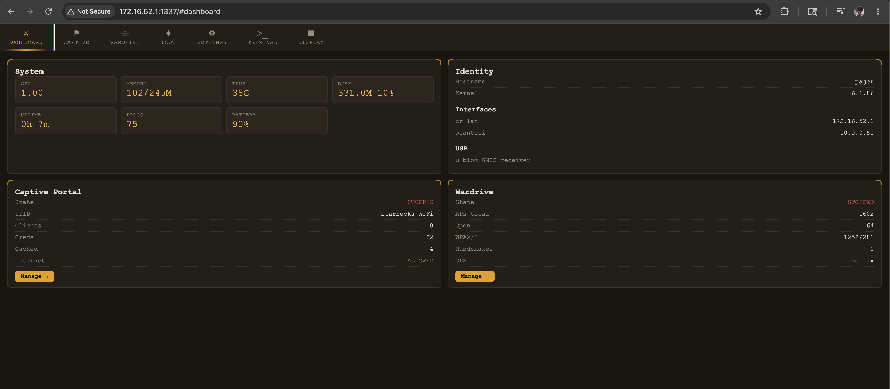 
*Main dashboard — bird's-eye view of all modules*

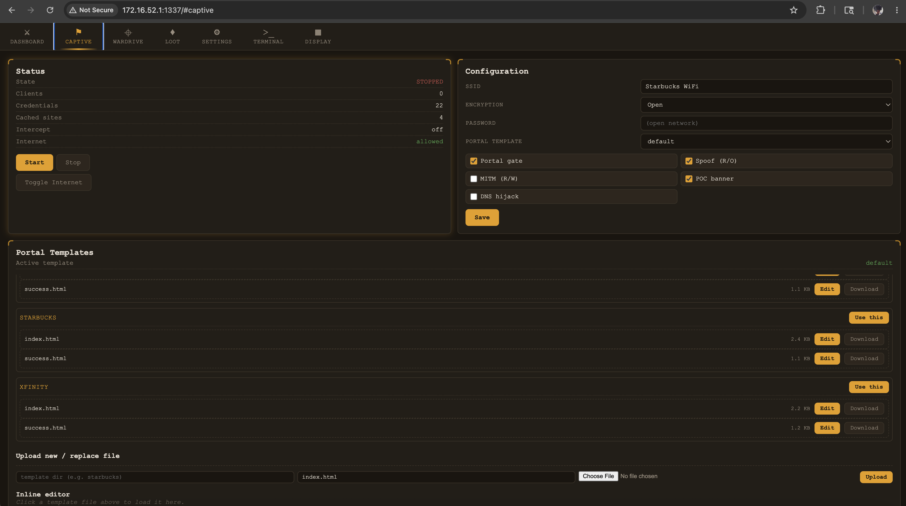 
*Captive portal control panel*

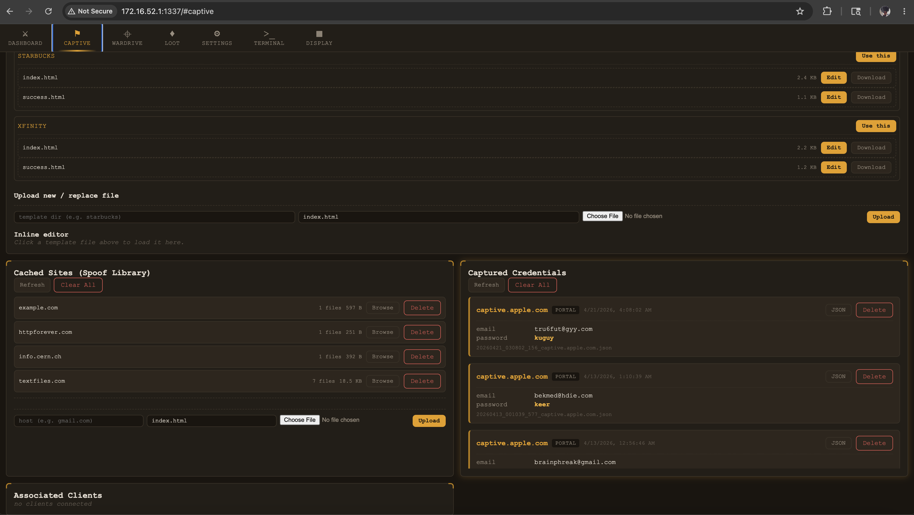 
*Captive portal — advanced options*

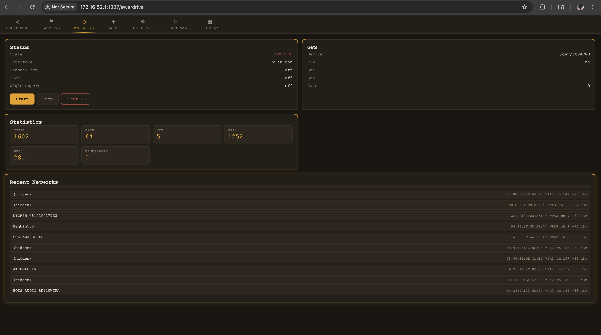 
*Wardrive control and live stats*

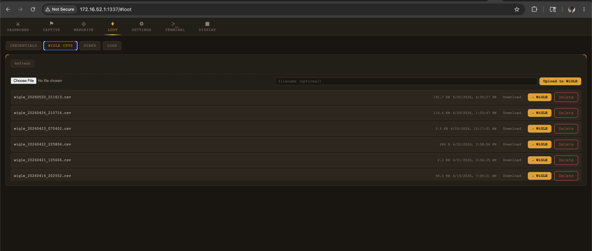 
*Loot section — credentials, Wigle files, pcaps, logs*

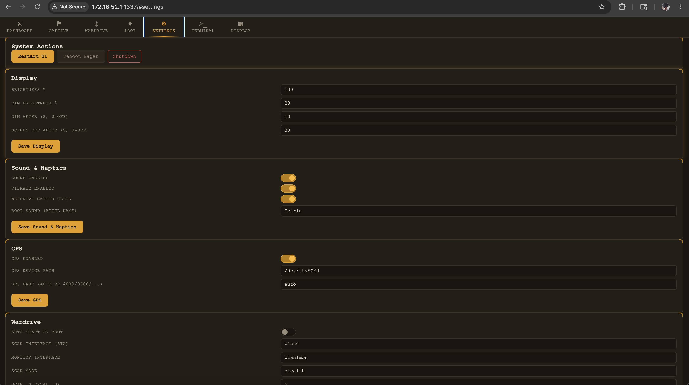 
*Settings panel*

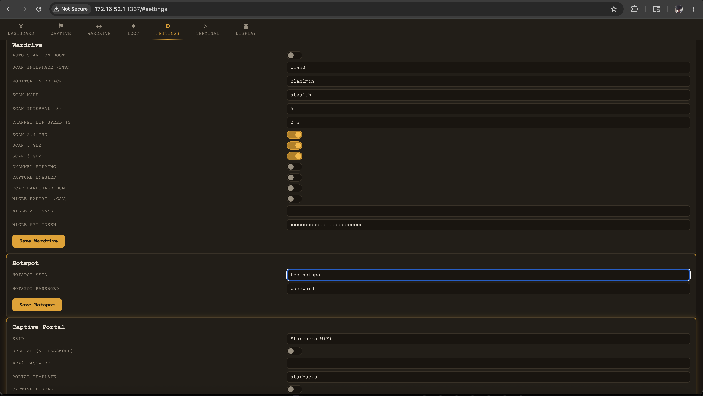 
*Settings panel — continued*

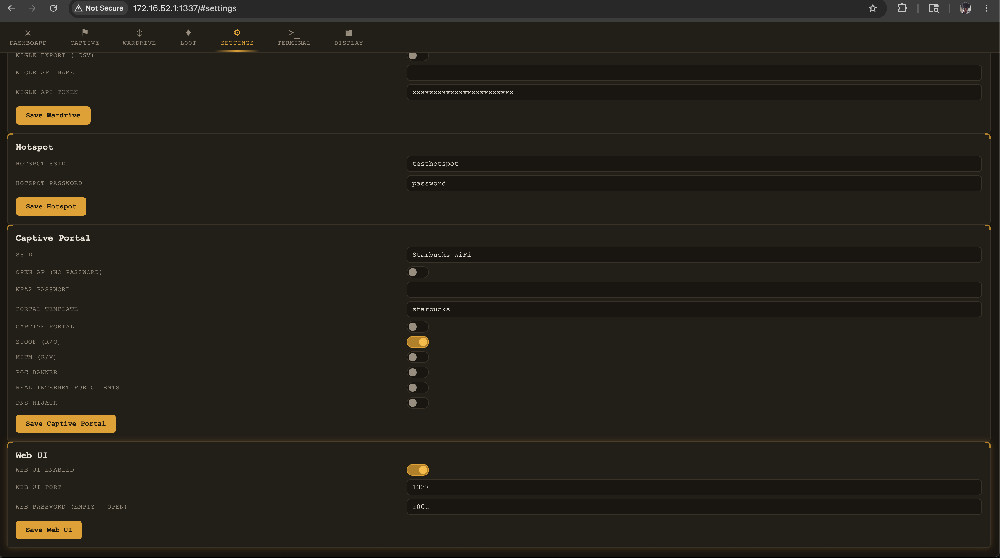 
*Settings panel — services*

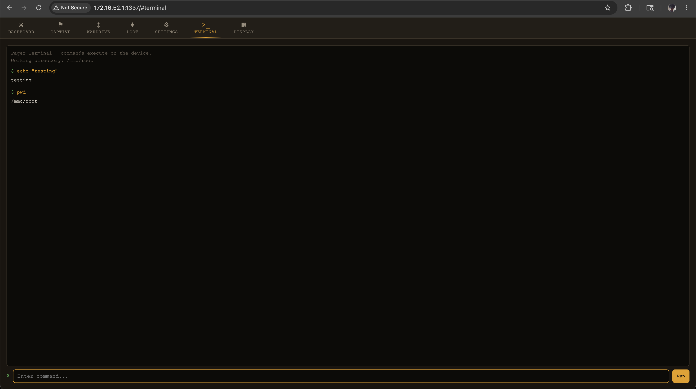 
*Built-in terminal*

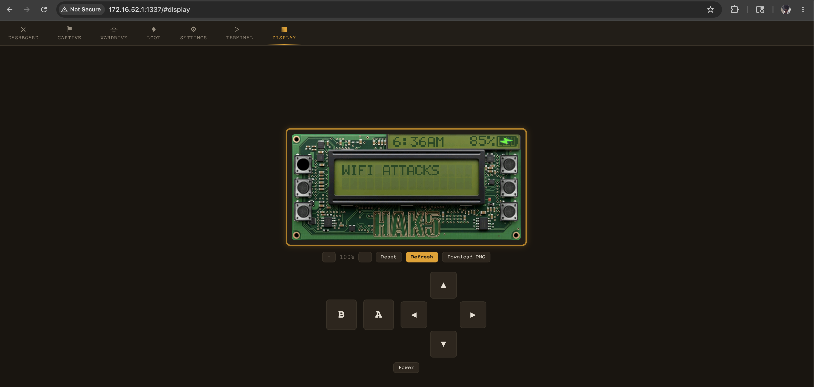 
*Live pager display and remote control*

---

### Pager Screen — On-Device UI

<table>
<tr>
  <td align="center">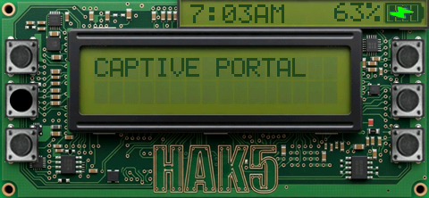 Main menu</td>
  <td align="center">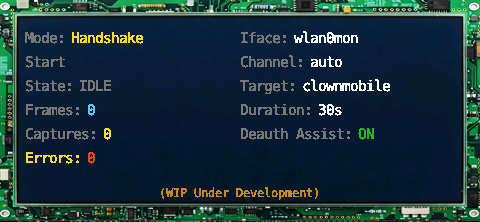 WiFi attacks dashboard</td>
  <td align="center">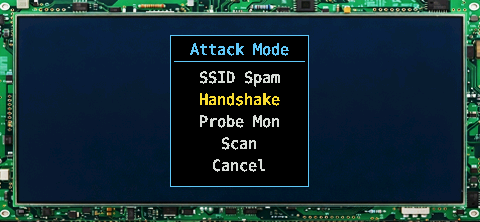 WiFi attacks menu</td>
</tr>
<tr>
  <td align="center">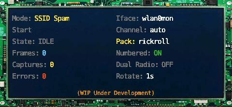 SSID spam mode</td>
  <td align="center">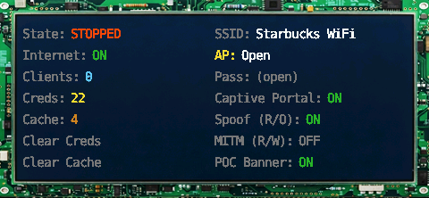 Captive portal dashboard</td>
  <td align="center">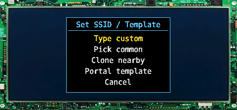 Captive portal main menu</td>
</tr>
<tr>
  <td align="center">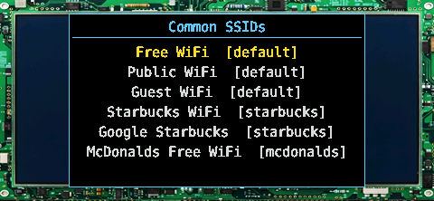 Captive portal options</td>
  <td align="center">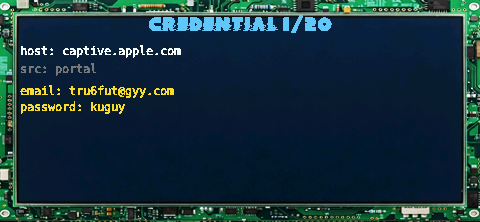 View captured credentials</td>
  <td align="center">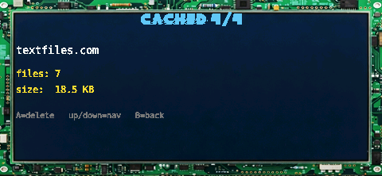 View cached sites</td>
</tr>
<tr>
  <td align="center">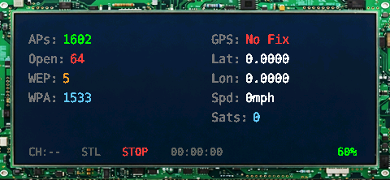 Wardrive dashboard</td>
  <td align="center">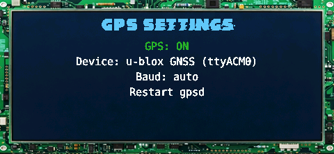 GPS settings</td>
  <td align="center">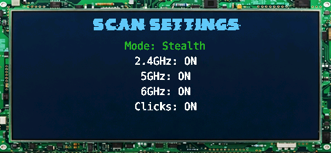 Wardrive scan settings</td>
</tr>
<tr>
  <td align="center">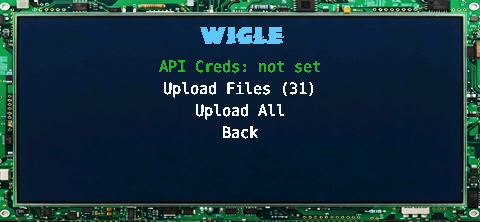 Wigle upload settings</td>
  <td align="center">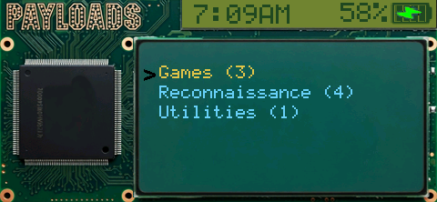 Payloads browser</td>
  <td align="center">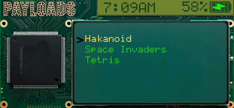 Payloads browser — more</td>
</tr>
<tr>
  <td align="center">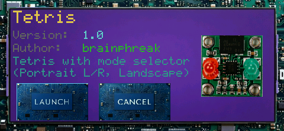 Launching a payload</td>
  <td align="center">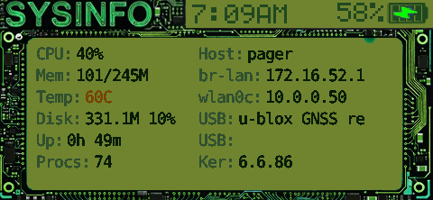 System info panel</td>
  <td align="center">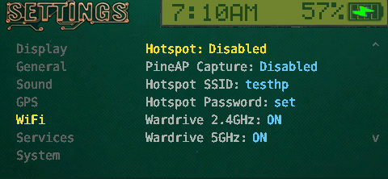 On-device settings</td>
</tr>
<tr>
  <td align="center">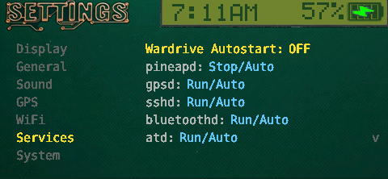 Services manager</td>
  <td align="center">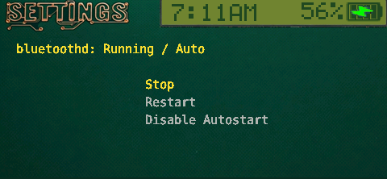 Autostart settings</td>
  <td align="center">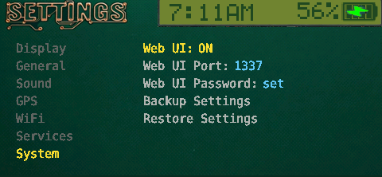 Backup & WebUI settings</td>
</tr>
<tr>
  <td align="center">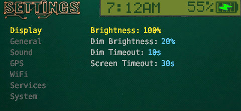 Brightness control</td>
  <td align="center">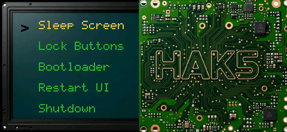 Power menu</td>
  <td></td>
</tr>
</table>

## Installation

Drop the `pagerctl_home/` directory into `/root/payloads/user/general/` on the pager. The payload appears in the Pineapple Pager UI under **General > Pagerctl Home** — launch it once to start using the custom home screen.

To take over at boot, install the [Pagerctl Bootloader](https://github.com/pineapple-pager-projects/pineapple_pager_bootloader) and enable **Settings > Auto Boot > Pagerctl Home**. On a fresh install the bootloader auto-boot default is already set to Pagerctl Home if it is detected.

## Controls

| Button | Action |
|--------|--------|
| D-pad | Navigate |
| A (GREEN) | Select / confirm |
| B (RED) | Back / cancel |
| POWER | Power menu |

Per-screen bindings are defined in each component's `button_map` block; themes can remap them.

## Configuration

- **Theme** — set via the `PAGERCTL_THEME` environment variable, falling back to `themes/Circuitry` if unset. Drop a new theme directory under `themes/` and point the env var at it. See [THEMING.md](payloads/user/general/pagerctl_home/THEMING.md) for the full authoring guide.
- **Settings** — persisted in `wardrive/settings.json` (shared) and `settings.json` (local overrides). Schema driven by `themes/<Active>/components/dashboards/settings_dashboard.json` — new settings can be added without touching Python.
- **Payloads** — see [PAYLOAD_AUTHORING.md](payloads/user/general/pagerctl_home/PAYLOAD_AUTHORING.md) for the `pagerctl.sh` contract, required metadata, Python skeleton, and duckyscript compatibility notes.

## Duckyscript Compatibility Note

Duckyscript support is a work in progress. The shim implements `LOG`, `ALERT`, `CONFIRM`, `LIST_PICKER`, `TEXT_PICKER`, `IP_PICKER`, `MAC_PICKER`, `NUMBER_PICKER`, `PROMPT`, `SPINNER`, `WAIT_FOR_INPUT`, and core LED/vibrate/beeper commands — but coverage is partial. Classic `payload.sh`-only payloads are hidden by default (opt in via **Settings > General > Show Classic Payloads**). For reliable integration, ship a `pagerctl.sh` launcher. Full compatibility will promote classic payloads to first-class support once remaining commands are wired.

## Related Projects

- [Pagerctl Bootloader](https://github.com/pineapple-pager-projects/pineapple_pager_bootloader) — pre-boot launcher that auto-boots into Pagerctl Home
- [Pagerctl](https://github.com/pineapple-pager-projects/pineapple_pager_pagerctl) — the underlying hardware control library (display, input, LEDs, audio, images)
- [Loki](https://github.com/pineapple-pager-projects/pineapple_pager_loki)
- [Wardrive](https://github.com/brainphreak/pineapple_pager_wardrive)
- [CYT](https://github.com/pineapple-pager-projects/pineapple_pager_cyt)
- [PagerGotchi](https://github.com/pineapple-pager-projects/pineapple_pager_pagergotchi)
- [PagerAmp](https://github.com/pineapple-pager-projects/pineapple_pager_pageramp_mp3_player)
- [Tetris](https://github.com/pineapple-pager-projects/pineapple_pager_tetris)
- [Space Invaders](https://github.com/pineapple-pager-projects/pineapple_pager_space_invaders)
- [Hakanoid](https://github.com/pineapple-pager-projects/pineapple_pager_hakanoid)

## Author

**brAinphreAk**

www.brainphreak.net · [Ko-fi](https://ko-fi.com/brainphreak)

## License

MIT License
